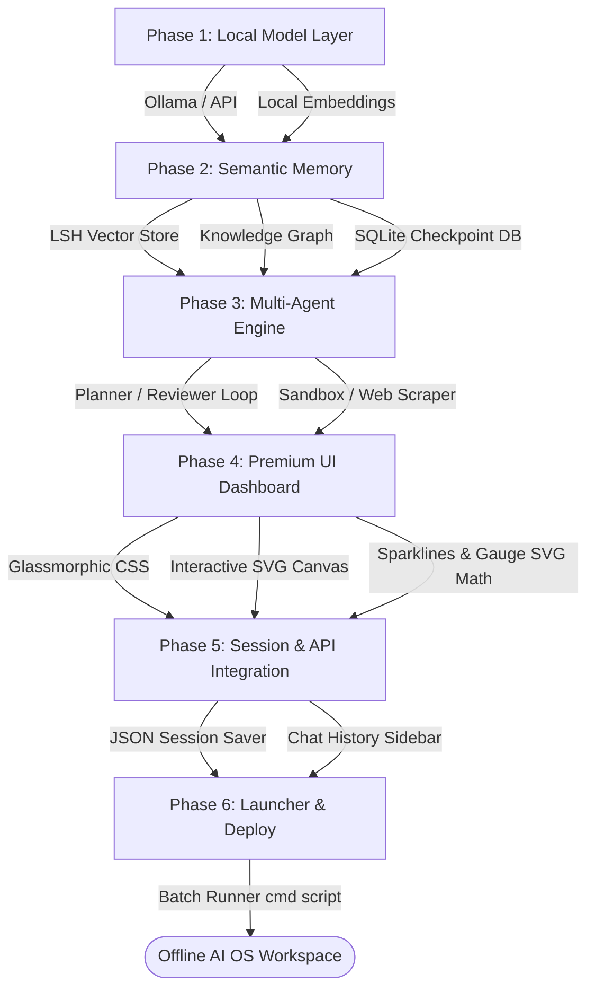

# Developer Build Guide: Building Offline AI OS From Scratch

This guide outlines the complete step-by-step roadmap, structural architecture, and critical considerations required to build a fully offline, multi-agent AI operating system and knowledge workspace from scratch.

---

## 🗺️ Build Roadmap Flowchart



---

## 🛠️ Step-by-Step Implementation Roadmap

### 📦 Phase 1: Local Model Layer & Environment Setup
Before writing any code, set up the offline runtime environment and local LLM access.
1.  **Local LLM Host (Ollama)**: Install Ollama on the system and download:
    *   An instruction-following model (e.g., `llama3` or `mistral`).
    *   An embeddings model (e.g., `nomic-embed-text` or `all-minilm`).
2.  **Virtual Environment**: Initialize a clean Python virtual environment to manage dependencies:
    ```bash
    python -m venv venv
    venv\Scripts\activate
    pip install requests pysqlite3  # Minimal dependencies
    ```
3.  **Config Provider (`config.py`)**: Define local URL bindings (e.g., `http://localhost:11434`) and default model names in a central settings file.

---

### 💾 Phase 2: Local Semantic Memory & Storage Systems
Build the database and search logic without relying on cloud service packages.
1.  **Locality-Sensitive Hashing (LSH) Vector Database (`core/vector_store.py`)**:
    *   Create a local vector store class that saves embeddings as a simple JSON map.
    *   Implement cosine similarity search.
    *   Implement LSH bucket partitioning to optimize vector queries locally.
2.  **Word-Overlap Validation (Defensive Filtering)**:
    *   *Critical Gotcha*: Basic vector search can pull unrelated records on short/generic tasks.
    *   *Implementation*: Create a validation filter that tokenizes and normalizes the query and the matched item's title. Reject matches with a word-overlap ratio under `0.70`.
3.  **Knowledge Graph Store (`core/knowledge_graph.py`)**:
    *   Define a JSON-backed node-edge network file structure.
    *   Expose utility functions to add nodes (topics/queries) and connect them with edges.
4.  **Task Queue & Checkpoints (`core/task_queue.py`)**:
    *   Set up a SQLite database (`queue.db`) to log background tasks, state (pending, running, completed, failed), payloads, priority, and outputs.

---

### 🤖 Phase 3: Multi-Agent Orchestration Engine
Build the reasoning pipeline that splits, routes, runs, and double-checks work.
1.  **Planner Agent**:
    *   Draft a strict system prompt instructing the LLM to output a JSON array of sub-tasks.
    *   *Gotcha*: Ensure task descriptions are self-contained (e.g., "Write Python script to scrape Generative AI foundations" instead of just "Write script") to prevent downstream agents from losing context.
2.  **Tool Router**:
    *   Direct agents to run specific local utilities:
        *   **Offline Web Scraper**: Resolves URL redirects, cleans raw HTML tags, and extracts readability text.
        *   **Code Execution Sandbox**: Writes temporary code scripts and runs them safely in a separate process using `subprocess.run()`.
3.  **Reviewer Agent**:
    *   Build a validation step. The Reviewer agent receives the user's objective, the execution plan, and the tool execution log outputs. It must return a boolean representing whether the task was fully accomplished, or raise correction flags to loop execution.

---

### 🎨 Phase 4: Developer-First Glassmorphic Dashboard UI
Build the web server and the frontend workspace interface.
1.  **Base HTTP Server (`core/dashboard_server.py`)**:
    *   Implement `BaseHTTPRequestHandler` using native Python libraries.
    *   Provide routing to serve static assets (`index.html`, `index.css`, `index.js`).
    *   Expose API endpoints to handle chat processing, queue streaming, graph retrieval, and session loading.
2.  **Glassmorphism UI Theme**:
    *   Apply a deep navy background grid pattern:
        ```css
        background-color: #060913;
        background-image: radial-gradient(rgba(255, 255, 255, 0.05) 1px, transparent 0);
        background-size: 24px 24px;
        ```
    *   Style cards with glassmorphic styling:
        ```css
        background: rgba(10, 16, 32, 0.7);
        backdrop-filter: blur(16px);
        border: 1px solid rgba(255, 255, 255, 0.05);
        box-shadow: 0 8px 32px 0 rgba(0, 0, 0, 0.3);
        ```
3.  **Interactive SVG Graph Canvas**:
    *   Draw the relation graph inside an SVG tag.
    *   Register zoom and pan event listeners. Track scale (`zoom`) and offset (`x`, `y`) coordinates during mouse-wheel and mouse-drag events, and apply a 2D transform to the SVG node container:
        ```javascript
        container.setAttribute('transform', `translate(${x}, ${y}) scale(${zoom})`);
        ```
    *   Style nodes as glowing polygons (hexagons) and animate connections with `stroke-dasharray` and `stroke-dashoffset` to show moving dashed patterns representing active data flows.
4.  **Metric Gauges & Sparkline Mathematics**:
    *   Compute SVG radial gauge stroke offsets programmatically based on the percentage metric value:
        ```javascript
        const strokeDashoffset = circumference - (percent / 100) * circumference;
        ```
    *   Generate sparklines using SVG `<path>` vectors: scale the metric's values relative to the canvas dimensions, then build a command string (e.g., `M 0 50 L 10 40 L 20 45...`).
5.  **Console Terminal Interface**:
    *   Configure a console-style input panel with blinking terminal block cursors.
    *   Implement autocomplete logic: when the user types, match the text against command keys (`ingest `, `scrape `, `clear`). Display choices in a dropdown, permitting navigation using arrow keys and selections via Enter/Tab.

---

### 💾 Phase 5: Multi-Session Workspace Switcher
Enable users to manage multiple independent conversations.
1.  **Session Directory (`data/sessions/`)**:
    *   Create a local folder to store user chat states.
    *   Save conversation exchanges and metadata as distinct JSON documents.
2.  **API Integration**:
    *   `GET /api/sessions`: Read the session files directory, sort by modification date, and return summary cards (title, timestamp, message count).
    *   `POST /api/sessions/new`: Clear active runtime session state to start a clean console workspace.
    *   `POST /api/sessions/load`: Load file contents into active memory and serve to the UI.
    *   `POST /api/sessions/delete`: Erase the specified JSON document from disk.

---

### 🚀 Phase 6: Script Launcher & Clean Packaging
Provide a single command file to start the system easily.
1.  **Write Launcher Batch File (`launch_dashboard.bat`)**:
    *   Detects if a Python virtual environment is present.
    *   *Gotcha*: Avoid using parenthesized `if/else` statements for printing status messages containing brackets or parentheses, as it breaks the cmd parser. Use `goto` labels to structure control flow instead.
    *   *Gotcha*: Do not use `timeout /t 2 /nobreak` inside non-interactive or redirected terminals. Use `ping 127.0.0.1 -n 3 >nul` to create a robust delay.
    *   Spawns python runner using `cmd /k` to leave the window open for easy debugging if python crashes.
2.  **Configure Repository Ignores (`.gitignore`)**:
    *   Ignore virtual environments (`venv/`, `.venv/`), IDE directories (`.idea/`, `.vscode/`), and python compiler caches (`__pycache__/`).
    *   Ignore locally generated databases (`data/*.db`), index values (`data/*.json`), scraped documents (`data/knowledge/`), and conversations (`data/sessions/`).
    *   Include empty directories using `.gitkeep` to preserve the folder tree.

---

## 💡 Key Lessons Learned & Development Best Practices
*   **Prompt Sanitization**: Ensure that formatting instructions in agent prompts demand strict JSON structures to prevent code evaluation crashes.
*   **Fuzzy Search Guards**: Combine vector similarity thresholds with direct string-matching verification. If matching exact roadmap stages, lexical matching filters out irrelevant results.
*   **Async Server Execution**: When executing multi-step goals, use Server-Sent Events (SSE) or chunked streams to keep the frontend updated in real-time, preventing request timeouts.
