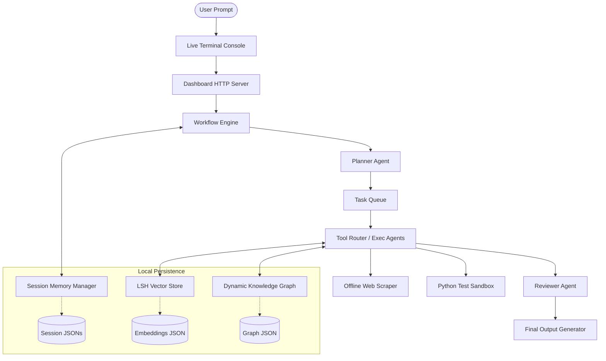

# Project DNA: Offline AI OS

> **A recruiter-grade, visual-first Local Multi-Agent Operating System & Knowledge Workspace.**
> Designed for 100% offline, privacy-first task planning, web scraping/ingestion, semantic memory retrieval, and dynamic relations mapping.

---

## 🌌 Project Overview & Problem Solved

Traditional AI assistants rely heavily on cloud APIs, raising data privacy concerns, and suffer from **context drift** or **hallucinations** during multi-step planning. Moreover, standard interfaces fail to display the underlying cognitive process of multi-agent execution, relation graphs, and background tasks.

**Offline AI OS** solves these core challenges by:
1. **100% Privacy & Zero-Data Leakage**: Runs entirely on local compute utilizing **Ollama** and a lightweight local math stack (LSH-based vector database).
2. **Multi-Agent Execution Loops**: Breaks large user goals down into modular sub-tasks managed by a planner, executed via tools, and validated by a reviewer before final output assembly.
3. **Fuzzy Caching Pollution Control**: Solves memory-caching hallucinations by implementing high-precision keyword/phrase overlap filters ($\ge 70\%$) and self-contained task generation.
4. **Immersive Command Center Dashboard**: Elevates developer workspaces using a cyberpunk, recruiter-grade glassmorphism user interface complete with interactive SVG relation graphs, latency sparklines, radial metric gauges, and multi-session workspaces.

---

## 🛠️ Architecture & Core Components

### 1. Multi-Agent Engine (`workflows/engine.py`)
Spawns specialized agent roles:
*   **PlannerAgent**: Breaks complex objectives down into a sequential, context-rich task plan.
*   **ToolRouter**: Dynamically dispatches tools (web scrapers, command executors, local files).
*   **ReviewerAgent**: Critically reviews task execution logs to verify correctness and flags discrepancies, forcing revision loops if necessary.

### 2. Locality-Sensitive Hashing Vector Store (`core/vector_store.py`)
An offline-first vector search module that handles high-dimensional embeddings generated by local Ollama models. It indexes scraped content and queries using LSH partitions to provide rapid semantic search without the overhead of heavy external vector database packages.

### 3. Relation Knowledge Graph (`core/knowledge_graph.py`)
Computes semantic connections between user inputs, ingested web pages, and generated topics. Dynamically draws links and nodes, saving the resulting network structure locally.

### 4. Session Memory Manager (`core/session_memory.py`)
Tracks conversation history, automatically generates titles from the first message, compiles context summaries, and serializes state as local JSON logfiles.

### 5. Asynchronous Task Queue (`core/task_queue.py`)
Manages background operations. Enables multi-step jobs to run asynchronously in a queue, prioritizing tasks and registering start/stop times and logs.

---

## ⚡ Tech Stack & Engineering Techniques

### 🟢 Beginner / Core Tech
*   **Python HTTPServer**: Pure HTTP REST API endpoints (`/api/status`, `/api/chat`, `/api/sessions/*`, etc.) without bulky frameworks.
*   **JSON Serialization**: Flat-file database layout for zero-configuration setup.
*   **Semantic HTML5 & Vanilla CSS**: Custom layout, grids, flexboxes, and dark themes.

### 🟡 Intermediate Tech
*   **SQLite Engines**: Powers task queues and execution checkpoints.
*   **Python Subprocess Sandbox**: Executes generated script code within isolated environments.
*   **CSS Variables**: Theme system with custom colors, blur levels, and hover responses.
*   **Double-Click Command Launcher**: Double-clickable `launch_dashboard.bat` script that manages environment initialization and opens the default browser automatically.

### 🔴 Advanced Tech
*   **Locality-Sensitive Hashing (LSH)**: Vector-space similarity calculations running locally.
*   **Context Collision Defenses**: High-precision word-overlap validators ($\ge 70\%$) preventing out-of-context caching retrieval, paired with self-contained system prompt task descriptors.
*   **Custom SVG Interactive Canvas**: Interactive network visualization utilizing drag-to-pan, mousewheel-to-zoom scaling physics, and animated dashed connection links representing active data flow.
*   **SVG Math Visualization**: Circular progress bars dynamically calculated using dashed stroke-offsets:
    $$\text{dashoffset} = \text{circumference} - \left( \frac{\text{percent}}{100} \times \text{circumference} \right)$$
*   **Interactive Command Autocomplete**: Blinking terminal console featuring autocomplete dropdowns that parse prefixes (`ingest`, `scrape`, `clear`) with keyboard navigation (Up/Down/Enter/Tab).

---

## 🎓 Showcase Roadmaps & Cognitive Workflows

When a complex roadmap query (e.g. *Generative AI Roadmap*) is submitted, the system triggers the following cognitive workflow:
1.  **Ingestion & Scrape**: Checks for relevant reference material or URL targets. Uses the offline web scraper to extract high-density text.
2.  **LSH Indexing**: The content is broken into blocks, embedded locally, and written to the vector store.
3.  **Task Graph Construction**: The Planner Agent maps out the sub-topics (e.g., Foundations, Transformers, Fine-Tuning, RLHF).
4.  **Verification Loop**: The Reviewer verifies that the generated roadmap details are authentic, free from unrelated cached memory, and accurate before marking the task complete.
5.  **Interactive Graph Rendering**: The dashboard renders these milestones as interconnected hexagonal nodes with glowing active connection lines.

---

## 📈 Performance & Diagnostic Verification
All subsystems are fully covered by a robust local unit testing suite:
*   `test_new_features.py`: Validates multi-session creation, loading, deleting, and API routes.
*   `test_polish_diagnostics.py`: Evaluates LSH recall, overlap filtering precision, and memory sanitation.
*   `test_planner.py` & `test_queue.py`: Checks multi-agent planning loops and SQLite task execution states.
